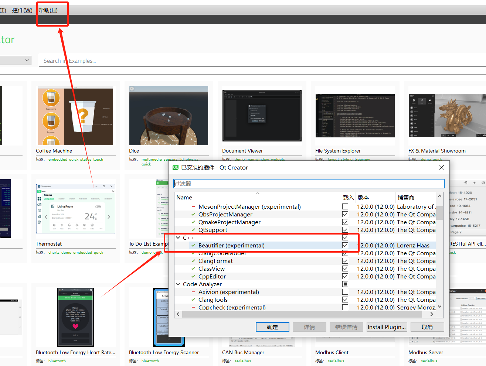
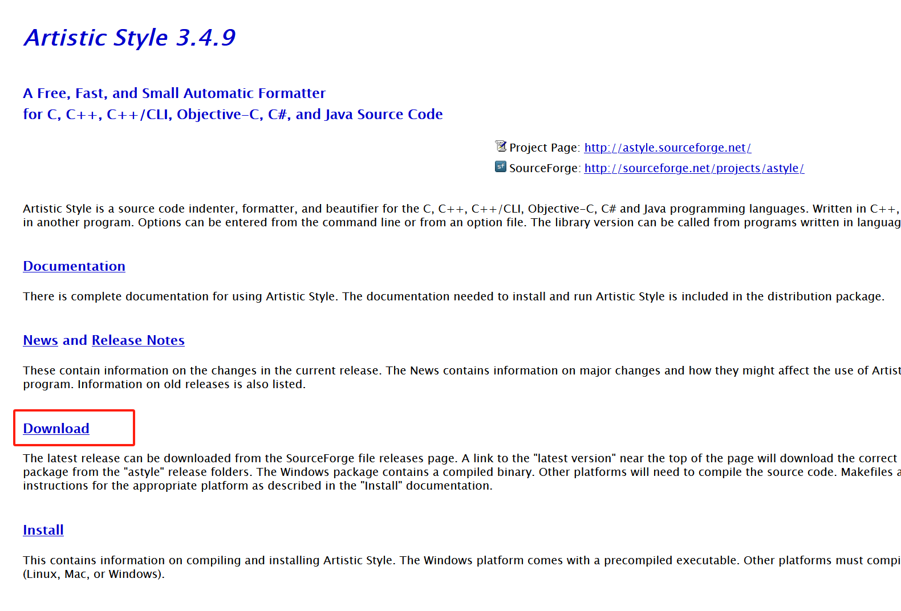
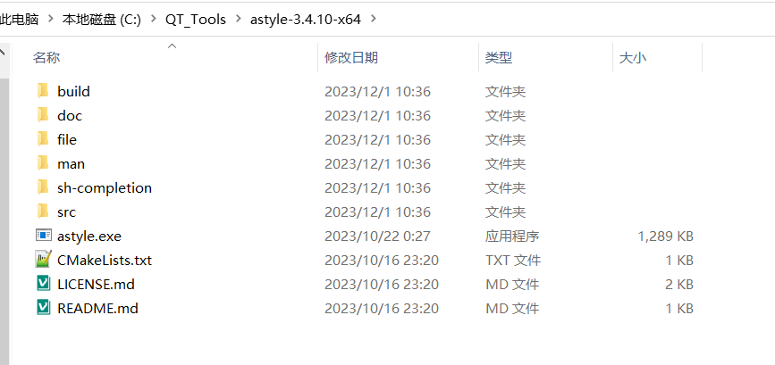
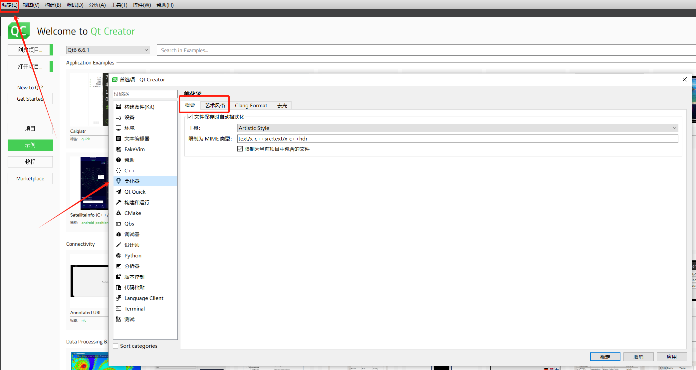
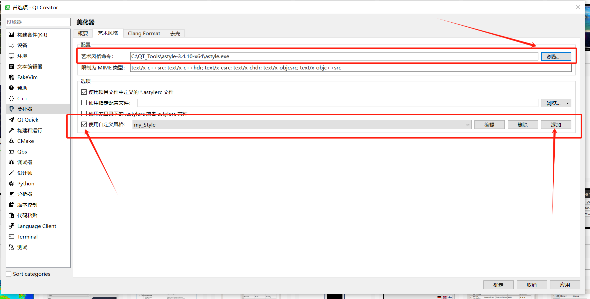
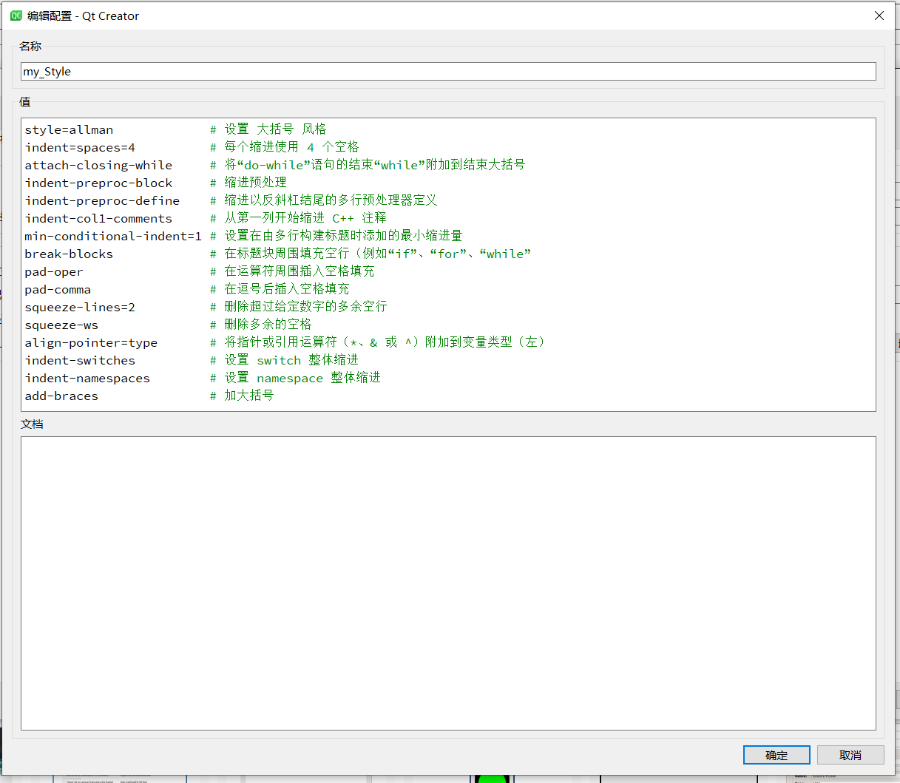

# QtCreator代码格式化.md


- [QtCreator代码格式化.md](#qtcreator代码格式化md)
  - [参考网址](#参考网址)
  - [安装插件](#安装插件)
  - [下载 ArtisiticStyle 工具](#下载-artisiticstyle-工具)
  - [配置 ArtisiticStyle](#配置-artisiticstyle)
    - [配置美化器](#配置美化器)
    - [配置 ArtisiticStyle](#配置-artisiticstyle-1)


## 参考网址

```
https://www.modb.pro/db/386030
https://cloud.tencent.com/developer/article/2181050?areaSource=106000.12&traceId=SceGiKmaOUWHzcl40S5Gb
```

## 安装插件

打开 Qt Creator 开发工具
通过“帮助”打开“关于插件”弹出框面板
在面板中查找 Beautifier 插件
在 “load” 项上面打钩
重启 Qt Creator 即可生效





## 下载 ArtisiticStyle 工具

>下载地址
```
https://astyle.sourceforge.net/
```



下载后解压放到合适目录
我放到了

```
C:\QT_Tools\astyle-3.4.10-x64
```



## 配置 ArtisiticStyle

### 配置美化器
打开 Qt Creator 开发工具
通过“编辑”打开“Preferences”弹出框面板
选中 "美化器"
选择 "概要" 工具选择 "ArtisiticStyle" 
选择 "文件保存是自动格式化"





### 配置 ArtisiticStyle

选择"艺术风格"
"艺术风格命令"中选择预览
加入刚才 ArtisiticStyle保存路径
```
C:\QT_Tools\astyle-3.4.10-x64\astyle.exe
```
选中 "使用自定义风格" 选则 "添加"
输入"名称"和"值"即可

设置完成后修改代码格式在代码中 "Ctrl+s"保存代码测试是否成功

>以下是我配置自己看的习惯的风格

```
style=allman             # 设置 大括号 风格
indent=spaces=4          # 每个缩进使用 4 个空格
attach-closing-while     # 将“do-while”语句的结束“while”附加到结束大括号
indent-preproc-block     # 缩进预处理
indent-preproc-define    # 缩进以反斜杠结尾的多行预处理器定义
indent-col1-comments     # 从第一列开始缩进 C++ 注释
min-conditional-indent=1 # 设置在由多行构建标题时添加的最小缩进量
break-blocks             # 在标题块周围填充空行（例如“if”、“for”、“while”
pad-oper                 # 在运算符周围插入空格填充
pad-comma                # 在逗号后插入空格填充
squeeze-lines=2          # 删除超过给定数字的多余空行
squeeze-ws               # 删除多余的空格
align-pointer=type       # 将指针或引用运算符（*、& 或 ^）附加到变量类型（左）
indent-switches          # 设置 switch 整体缩进
indent-namespaces        # 设置 namespace 整体缩进
add-braces               # 加大括号
```

>可以在ArtisiticStyle官方文档中选择合适自己的风格配置

```
https://astyle.sourceforge.net/astyle.html
```







