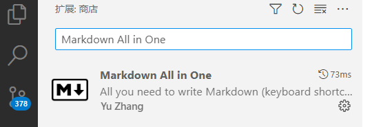
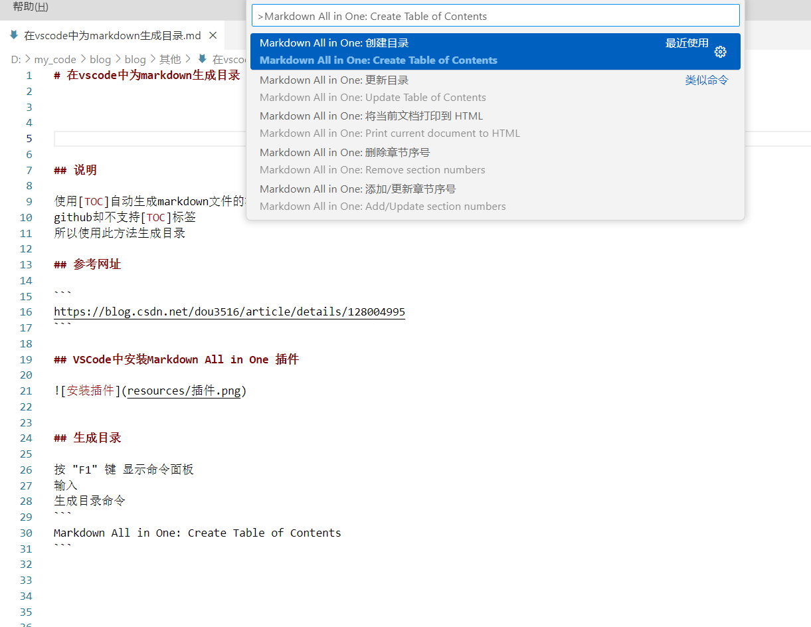
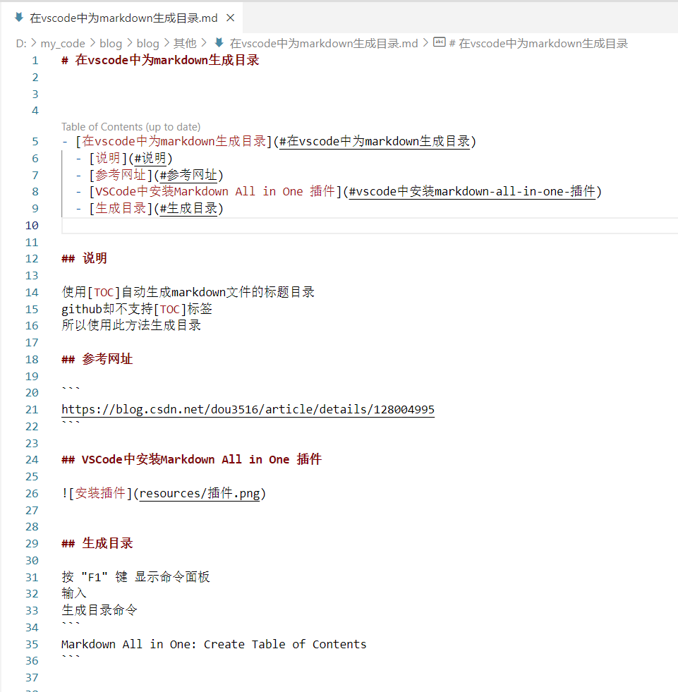

# 在vscode中为markdown生成目录


- [在vscode中为markdown生成目录](#在vscode中为markdown生成目录)
  - [说明](#说明)
  - [参考网址](#参考网址)
  - [VSCode中安装Markdown All in One 插件](#vscode中安装markdown-all-in-one-插件)
  - [生成目录](#生成目录)


## 说明

使用[TOC]自动生成markdown文件的标题目录
github却不支持[TOC]标签
所以使用此方法生成目录

## 参考网址

```
https://blog.csdn.net/dou3516/article/details/128004995
```

## VSCode中安装Markdown All in One 插件




## 生成目录

按 "F1" 键 显示命令面板
输入
生成目录命令
```
Markdown All in One: Create Table of Contents
```






